[Servo](https://github.com/lbailey58/engr3/blob/main/README.md#servo)

[Distance Sensor](https://github.com/lbailey58/engr3/blob/main/README.md#distance-sensor)

[Motor Control](https://github.com/lbailey58/engr3/blob/main/README.md#motor-control)

[Photointerupter](https://github.com/lbailey58/engr3/blob/main/README.md#photointerupter)

[The Hanger](https://github.com/lbailey58/engr3/blob/main/README.md#the-hanger)

[Swing Arm](https://github.com/lbailey58/engr3/blob/main/README.md#swing-arm)

[Multi-Part Design Studio](https://github.com/lbailey58/engr3/blob/main/README.md#multi-part-design-studio)

[Onshape Certification Prep 1](https://github.com/lbailey58/engr3/blob/main/README.md#onshape-certification-prep-1)

[Onshape Certification Prep 2](https://github.com/lbailey58/engr3/blob/main/README.md#onshape-certification-prep-2)

[Onshape Certification Prep 3](https://github.com/lbailey58/engr3/blob/main/README.md#onshape-certification-prep-3)

[Alignment Plate](https://github.com/lbailey58/engr3/blob/main/README.md#alignment-plate)

[Rotary Encoder](https://github.com/lbailey58/engr3/blob/main/README.md#rotary-encoder)

[Stepper Motor](https://github.com/lbailey58/engr3/blob/main/README.md#big-ol-motor)

[IR Sensor](https://github.com/lbailey58/engr3/blob/main/README.md#ir-sensor)

[Robot Gripper](https://github.com/lbailey58/engr3/blob/main/README.md#robot-gripper)

[COPY THIS](https://github.com/lbailey58/engr3/blob/main/README.md#copy-this)

## Servo

### Description & Code
We were assigned to make a 180° servo sweep back and forth between 180° and 0°, but I
made mine spicy by having the servo be controlled by two capacitave touch wires.

```python
# SPDX-FileCopyrightText: 2018 Kattni Rembor for Adafruit Industries
#
# SPDX-License-Identifier: MIT

"""CircuitPython Essentials Servo standard servo example"""
from time import sleep
import board
import pwmio
from adafruit_motor import servo
import touchio #imports


# create a PWMOut object on Pin A2.
pwm = pwmio.PWMOut(board.A2, duty_cycle=2 ** 15, frequency=50)

# Create a servo object, my_servo.
my_servo = servo.Servo(pwm)

pin1 = board.A0 #the pins of the cap touch
pin2 = board.A1
angle = 90 #declaring a variable to store the angle of the servo in


touch1 = touchio.TouchIn(pin1)
touch2 = touchio.TouchIn(pin2) #declaring the cap touch

while True: #starting the loop
    if(not(touch1.value is touch2.value)): #as long as they are not both being touched
        if(touch1.value and angle < 180): #if one of them is being touched write down to move right
            angle += 0.25
        elif(touch2.value and angle > 0):#if the other one of them is being touched write down to move left
            angle -= 0.25
    my_servo.angle = angle #actually move left/right
    sleep(0.0025) #wait a little bit
```

### Evidence


The servo moves back and forth when I touch the different wires
### Wiring
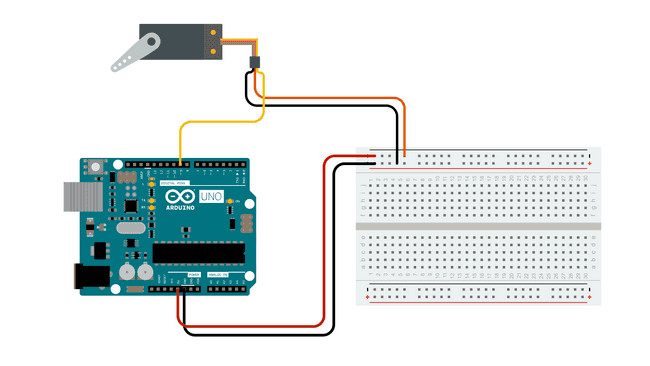

Except, there would be wires on A0 and A1 for capacitive touch

Image credit to [Arduino](https://docs.arduino.cc/learn/electronics/servo-motors)

### Reflection
The assignment was great; it let me learn the ropes of github and Visual Studio code. I also really enjoyed learning about Capacitave touch, which I think to be easier to use than buttons. This assignment was a great intro into working in VS code and helped me get used to all of the processes asociated with it.

## Distance Sensor

### Description & Code
We were assigned to use a distance sensor to make the color of a light move through a rainbow\

```python
#imports
import time
import board
import adafruit_hcsr04
import adafruit_rgbled

cm = 0
#starting the distance sensor
sonar = adafruit_hcsr04.HCSR04(trigger_pin=board.D7, echo_pin=board.D8)

#starting the rgb led
red = board.D10
green = board.D11
blue = board.D12
led = adafruit_rgbled.RGBLED(red, green, blue)

while True:
    try: #here in case the sensor hits nothing

        cm = sonar.distance #making it so that cm is a constant

        # (-1*(cm-x)+5) phase out color
        # (cm-x)*25.5 phase in color
        # (red, green, blue)
        if(cm < 15 and cm > 5):
            led.color = (255, 0, (cm-5)*25.5)
        elif(cm is 15):
            led.color = (255, 0, 255)
        elif(cm > 25 and cm < 35):
            led.color = (0, (cm-25)*25.5, 255)
        elif(cm < 5):
            led.color = (255, 0, 0)
        elif(cm > 45):
            led.color = (0, 255, 0)
        elif(cm > 15 and cm < 25):
            led.color = ((-1*(cm-20)+5)*25.5, 0, 255)
        elif(cm > 35 and cm < 45):
            led.color = (0, 255, (-1*(cm-40)+5)*25.5) 
        elif(cm is 25):
            led.color = (0, 0, 255)
        elif(cm is 35):
            led.color = (0, 255, 255)
    except RuntimeError:
        print("Retrying!")
    print(cm)

    time.sleep(0.1) #wait a bit

```

### Evidence


The led changes colors when I move the acrylic up and down
### Wiring
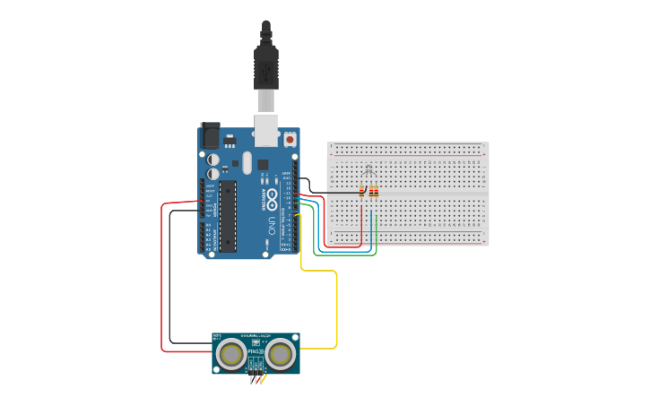

Credit to [Hasan Ahmed](https://www.tinkercad.com/things/5REip7gcB1n)
### Reflection

This assignment was hard for me because it heavily relied on being able to find a good library in order to make it work.
This was not helped by the fact that even when I got a library that should have worked, it did not work because I had my cathode rgb led wired like an anode rgb led.
All of the problems I faced culminated in me being unprogressive for multiple class periods in a row, even though I was trying to be productive.
One thing I learned from this assignment is that the examples on websites with libraries will not always be exaclty what you need, so you need to build a frankenstein of code from multiple differnent websites.

## Motor Control

### Description & Code
We were assigned to control a motor with a potentiometer without using an H-Bridge

```python

#imports
import board
import pwmio
from analogio import AnalogIn

#Setting up the potentiometer
potentiometer = AnalogIn(board.A0)

#Setting up the motor
motor = pwmio.PWMOut(board.D3, frequency=5000, duty_cycle=65535)


while True:
    #Makes it so the value doesn't change mid-loop
    a = potentiometer.value

    #sets the motors speed to the potentiometer value
    motor.duty_cycle = a

    #prints the value
    print(a)

```

### Evidence


### Wiring
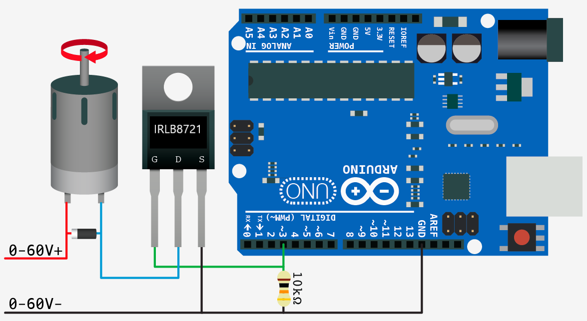

Credit to [Mr. Helmsetter](https://cvilleschools.instructure.com/courses/40347/assignments/544954?module_item_id=1907201)

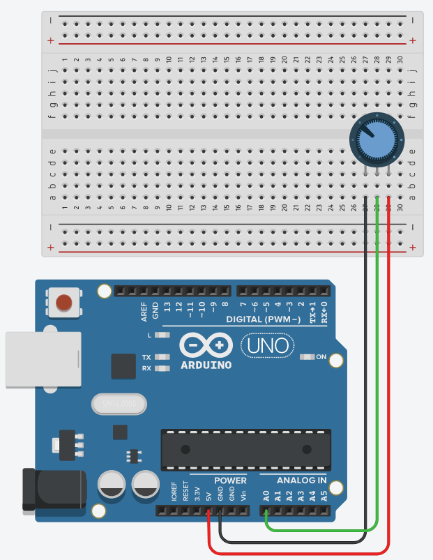

Credit to [the Robotics Back-End](https://roboticsbackend.com/arduino-potentiometer-complete-tutorial/)

### Reflection

This assignment was useful for learning how to control a motor in circuitpython.
I was suprised that we did not use H-Bridges and I think that the way that we do it is a bit overcomplicated.
One challenge I ran into along the way was a battery with a negative charge, witch was something I had never seen before.
Overall this assignment was a good way to learn how to learn about new compnents and a good way to learn to control a motor.


## Photointerupter

### Description & Code
We were assinged to make something that outputed "I have been interupted x times" (x = number of times interupted) every 4 secords.

```python
#imports
import digitalio
import board
import time

#declaring the photointerupter as an object
pi = digitalio.DigitalInOut(board.D3)

#other variable declares (ignore misspelling)
inerupts = 0
x = False

while True:
    #getting the time since the start of the program
    now = time.monotonic()
    
    #if it's interupted and not bouncing add one to interupts
    if(pi.value and not x):
        inerupts +=1
        x = True

    #Every 4 seconds print the message
    if(now % 4 == 0):
        print("I have been interupted "+ str(inerupts) +" times")
    
    #debouncing
    if(x and not pi.value):
        x = False

```

### Evidence


### Wiring
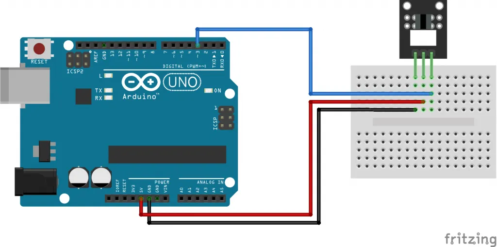

Everything is the same as the photo except that we used different photointerupters

Credit to [Arduino Modules](https://arduinomodules.info/ky-010-photo-interrupter-module/)

### Reflection
During this asignment, I learned how to use the time.monotonic function as well as the photointerupter in circuitpython. 
This assignment was also useful for learning the digitalio library. One issue that I ran into was that my photoinerupter wasn't triggering.

## The Hanger

### Description
We were assigned to make a part from a drawing

[Onshape Link](https://cvilleschools.onshape.com/documents/8c427e1606f1d98488399484/w/542500ae5d8a09b11482a609/e/cdeced8ec882bba05865d85d?renderMode=0&uiState=652ed73b2144ae45637caf8f)


### Evidence
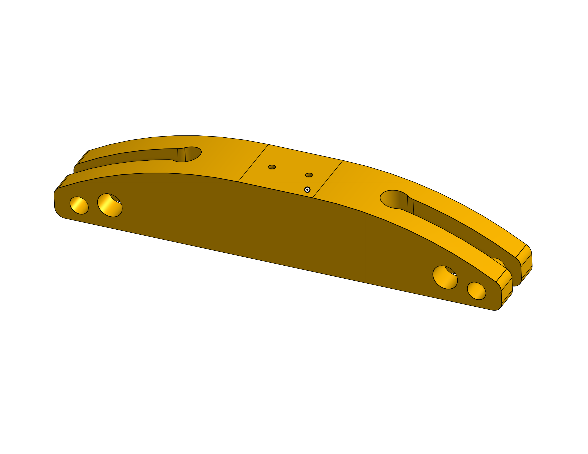

### Reflection
This assignment was a good refesher for CAD. 
It warmed me back up after the summer away.
I didn't really learn anything new because the part was pretty simple.

## Swing Arm


### Description
In this assignment, we were told to create a complex part from drawings. We had to use variables in our design to make it so that we could change the part later.

[Onshape Link](https://cvilleschools.onshape.com/documents/62792585bf20051ac83ecd4c/w/260f2a6b03b6cee2875957cb/e/51c002dab6e73429a487b67d?renderMode=0&uiState=652ed78f7160a27eab2d3a30)

### Evidence

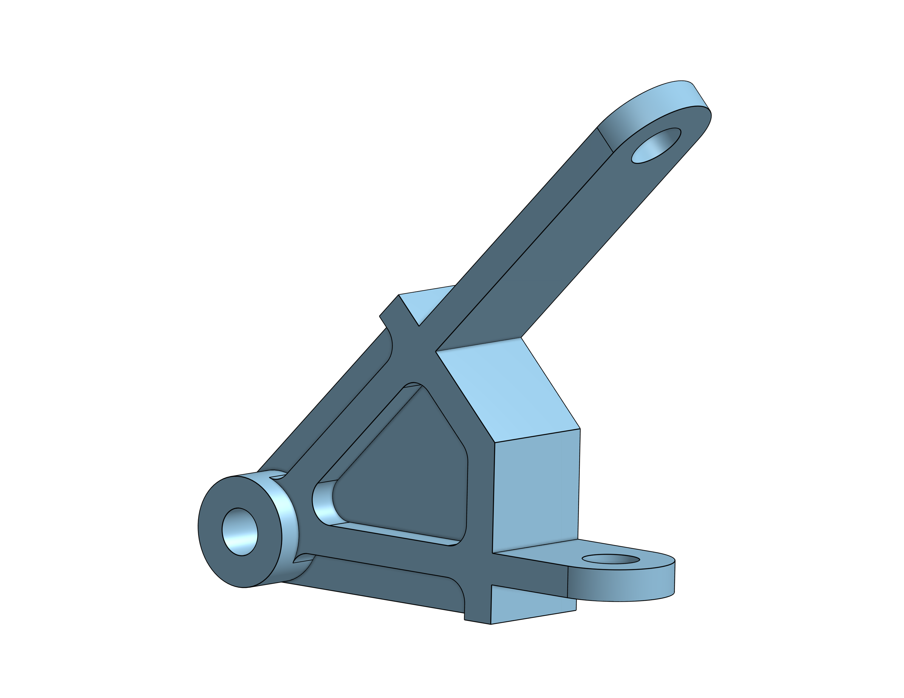
### Reflection
This assignment was challenging because of the complexity of the part and the amount of information we were given. This assignment taught me how to make sense of more complex drawings. I had one main error, wich was that I mixed up the sides of the arm (one is long and the other is short)

## Multi-Part Design Studio

[Onshape Link](https://cvilleschools.onshape.com/documents/58a3594e4e10554dbc6d1c39/w/32943e04a46017f96e2fdeb9/e/db070eef3377c1caabf170a6?renderMode=0&uiState=653abb3bf2d96d054b099260)

### Description
We were assigned to answer a questions in wich we had to make muliple parts and then get the correct mass for all of the parts combined.
We then had to modify the parts 3 times and see if the part studio did not break.


### Evidence
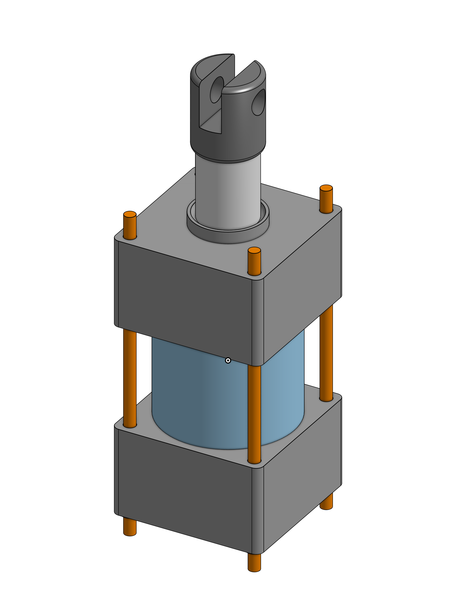

### Reflection
This assignment was very helpful in seeing what the Onshape Exam would be like. One thing that made it kinda simple is that the drawings were in the order that you used them in the pdf. This assignment was helpful in reminding me to name my parts, assign materials to my parts, and constrain my parts in relation to other parts. 

## Onshape Certification Prep 1

[Link](https://cvilleschools.onshape.com/documents/1bd98e3fb4eadb199d99951c/w/c390e2815e6b0a5f252b8f77/e/645f395c24c880a47b25b640?renderMode=0&uiState=6543f491b9ea18220db37a6f)

### Description
We were assigned to CAD an object and input it's mass into a quiz. We then had to modify the object and input the mass into the quiz 4 times.

### Evidence

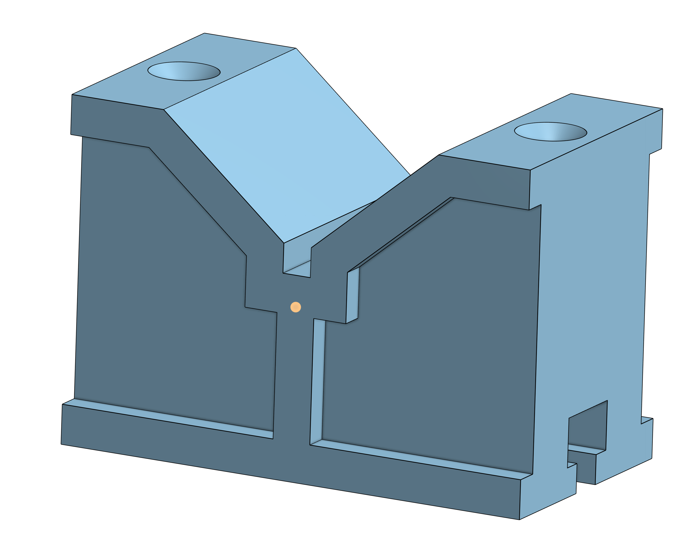

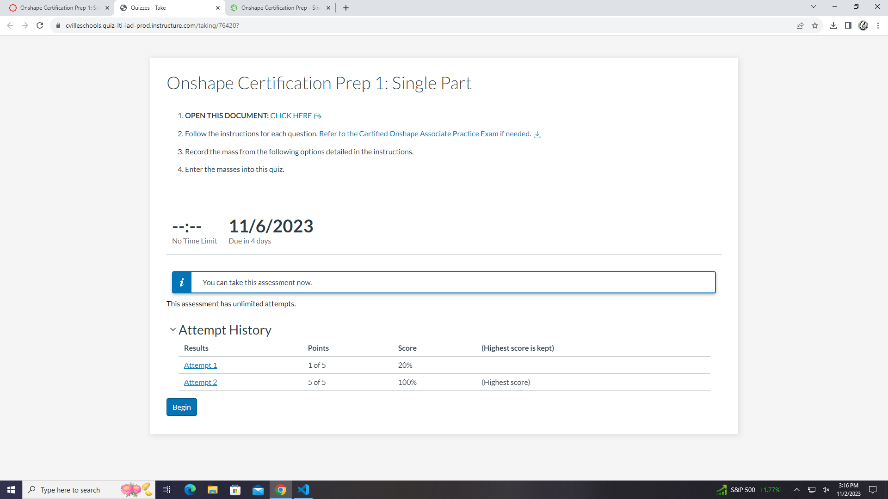


### Reflection
This assignment was very helpful practice for the Onshape certification exam. It allowed me to get used to using variables for stated (and not stated) things. One thing I learned in this assignment is that I need to not make mistakes on the exam because I had a good time, but then I realised that I made a mistake on the first question that I had to go back and fix; the mistake lost me ~30 minutes.

## Onshape Certification Prep 2

### Description & Code

[Link](https://cvilleschools.onshape.com/documents/4bbe7e04faa52698a61c2c4c/w/9658eebc735cd5ae2c3daca6/e/ad26efe465ef641c8568e031?renderMode=0&uiState=654bf516913c3b76e250ded3)

We were assigned to draw a 3d microphone stand from drawings and then modify the drawing.

### Evidence
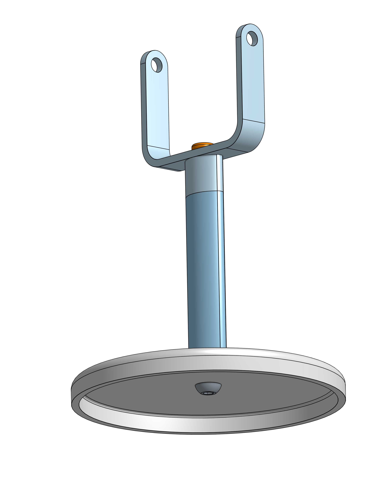

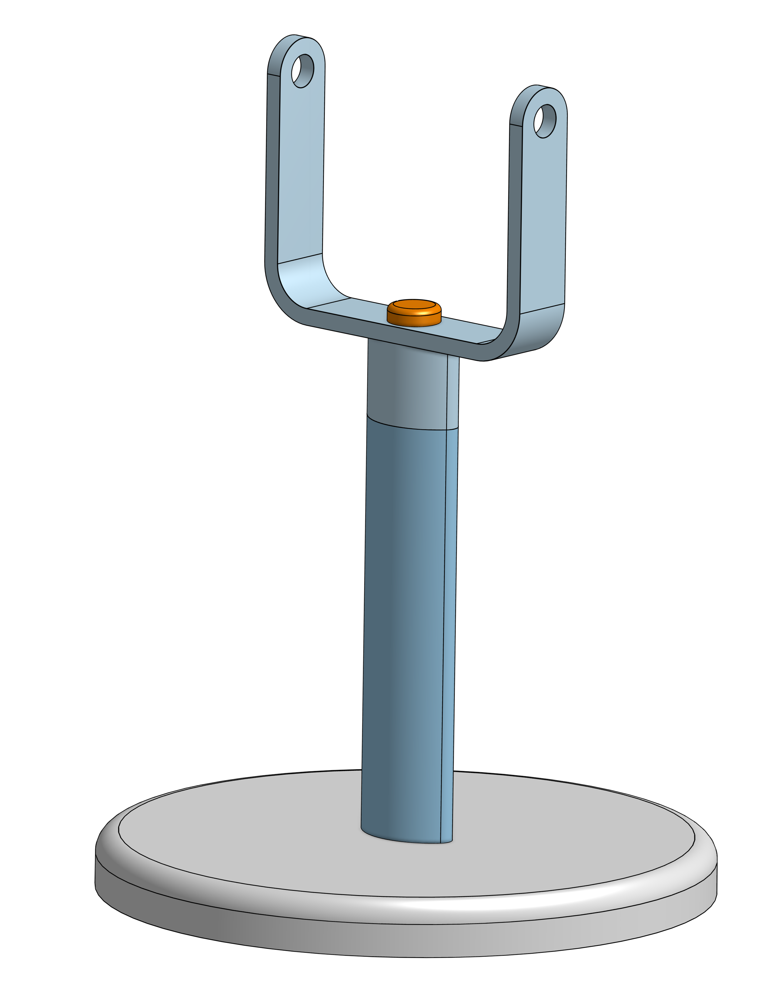

### Reflection
This assignment did not go as well as I as hoped because I made 2 mistakes that took a while to find. This assignment helped me understand more what the test would look like. I did not enjoy how many times I had to set material in this assignment because of one of the mistakes I made.

## Onshape Certification Prep 3

### Description & Code

[Link](https://cvilleschools.onshape.com/documents/e2f66c0e220d5f77819193a7/w/9539617efb8bf9b447058356/e/258be92b4d86c51425ebefd4?renderMode=0&uiState=6601d53aea4fbc12c7d5fb97)

We were assigned to assemble a pliers in Onshape and then were asked questions about the pliers at different levels of openness.

### Evidence
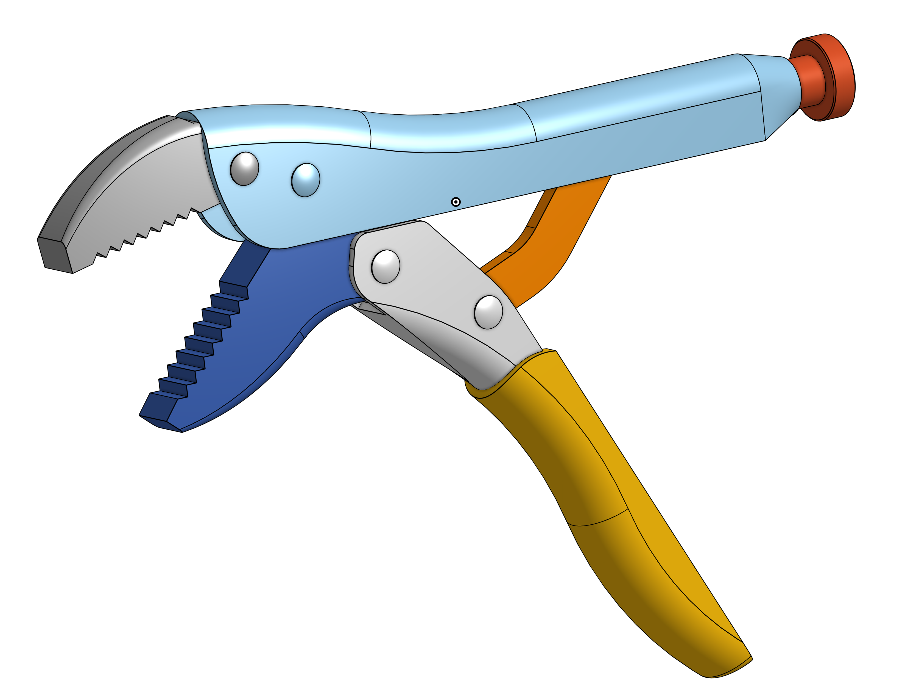

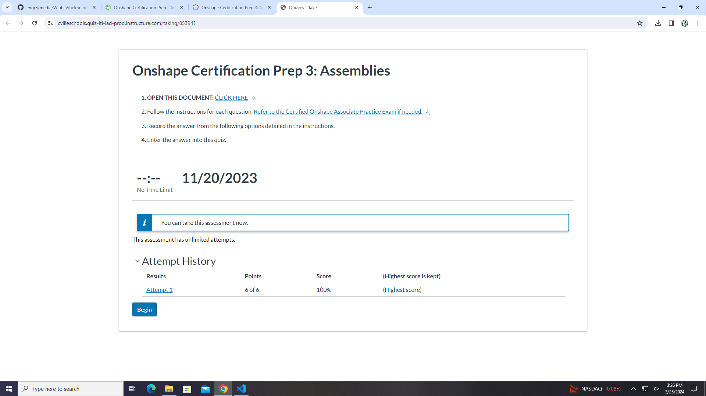

### Reflection

This assignment was pretty easy because all it was was using the measure tool and different types of mates. I think it was pretty easy compared to having to CAD something from scratch. I do think that being able to do assemblies is should be a required skill in order to get the certification so I do think that this assignment is a good one.

## Alignment Plate

[Link](https://cvilleschools.onshape.com/documents/8c427e1606f1d98488399484/w/542500ae5d8a09b11482a609/e/73cac0865da2c19894056b2e?renderMode=0&uiState=654d3da0107b3f57d925d94d)

### Description & Code
We were assigned to do the easiest CAD challenge


### Evidence

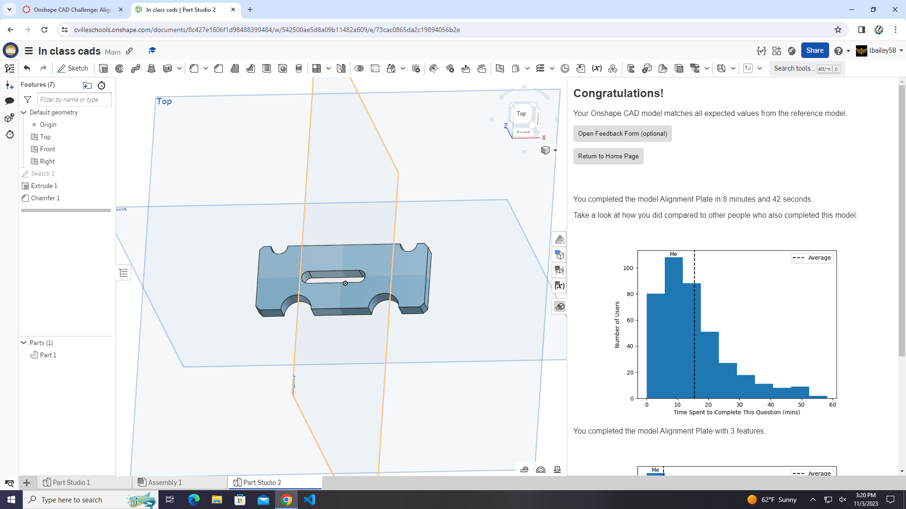

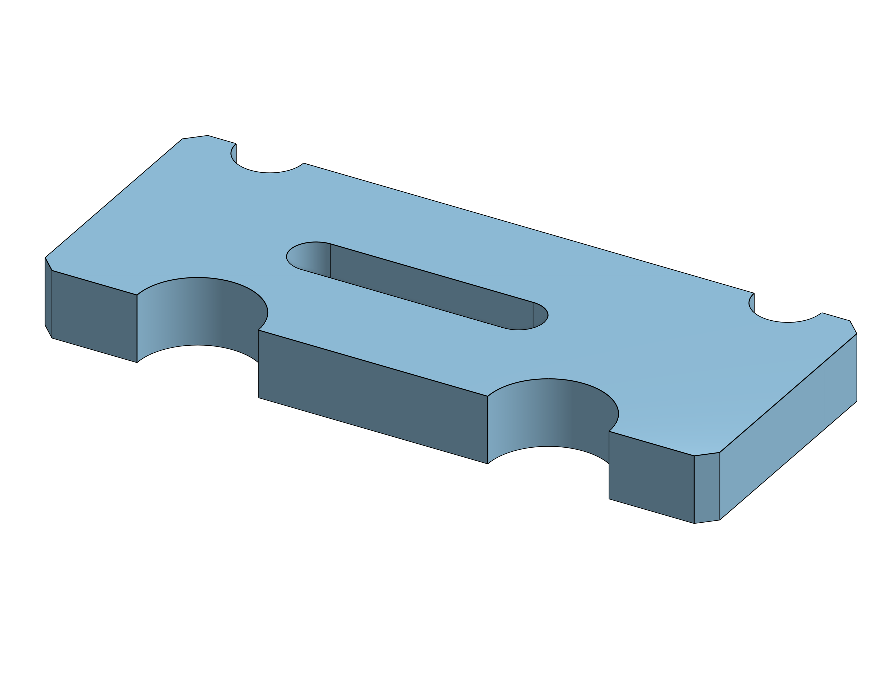

### Reflection

This assignment was extremely easy, took me less than 10 minutes, and honestly, doesn't deserve to be documented (but I want the points so I am anyway). I had already competed this CAD challenge before it was assigned as an assignment, but I had to redo it. It was a lot easier to do the second time because I knew that the center slit was not centered.


## Rotary Encoder

### Description & Code
We were assigned to use a rotary encoder, an lcd, and our boards built-in neopixel to create a controllable stoplight. A menu on the lcd is controlled by the rotary encoder's rotation, with the button feature used to switch the color of the neopixel. 

```python
#Original Code By Rachel Gibson

#importing all of my stuff
import rotaryio
import board
import neopixel
import digitalio
from lib.lcd.lcd import LCD
from lib.lcd.i2c_pcf8574_interface import I2CPCF8574Interface

#creating some variables
menu = ["stop", "caution", "go"]
last_index = None
menu_index = 0

#creating some objects (enc = encoder, lcd = liquid crystal display, led = light emitting diode)
enc = rotaryio.IncrementalEncoder(board.D4, board.D3, divisor=2)
lcd = LCD(I2CPCF8574Interface(board.I2C(), 0x3f), num_rows=2, num_cols=16)
led = neopixel.NeoPixel(board.NEOPIXEL, 1)

#setting the brightness of the neopixel and the original color of it (red)
led.brightness = 0.3
led[0] = (255, 0, 0)

#setting up the button
button = digitalio.DigitalInOut(board.D2)
button.direction = digitalio.Direction.INPUT
button.pull = digitalio.Pull.UP
button_state = None

#THE LOOP
while True:
    #getting where the encoder is
    menu_index = enc.position
    #getting what color the encoder is on
    menu_index_lcd = menu_index%3
    #Writing on the lcd
    lcd.set_cursor_pos(0,0)
    lcd.print("Push For: ")
    if last_index is None or menu_index is not last_index: #if it's the first time or the knob has been twisted
        #printing stuff out to the lcd
        lcd.set_cursor_pos(1,0)
        lcd.print("          ")
        lcd.set_cursor_pos(1,0)
        lcd.print(menu[menu_index_lcd])
    last_index = menu_index
    if not button.value and button_state is None: #debouncingness
        button_state = "pressed"
    if button.value and button_state == "pressed": #sets the colors
        if menu_index_lcd == 0:
            led[0] = (255, 0, 0)
        elif menu_index_lcd == 1:
            led[0] = (255, 255, 0)
        else:
            led[0] = (0, 255, 0)
        button_state = None
```

### Evidence 


### Wiring

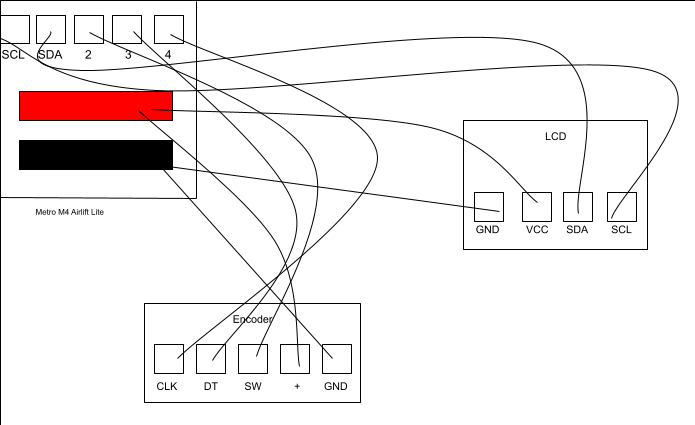

### Reflection

This assignment was nice in that I did not have to find all of the code online, instead I just had to complete the code from the slideshow. This assignment was good in that later (maybe on my project) I will be able to copy and paste code from this assignment in order to have an easy neopixel/encoder/lcd (I'll be able to set it up in a minute instead of an hour or two). I learned how to use an array in circiutpython, how to use an lcd, and how to use an encoder during this assignment.

## Big Ol Motor

### Description & Code
We were assigned to control a stepper motor so that it continued to rotate until it hit a limit switch, upon wich it would rotate backwards for a liitle bit before continuing to rotate forwards.

```python
import asyncio
import board
import keypad
import time
import digitalio
from adafruit_motor import stepper
#import the things that need to be imported

#Setting some variables to be used later
DELAY = 0.01
STEPS = 1

#               A1                                  A2                                  B1                              B2        
coils = (digitalio.DigitalInOut(board.D9), digitalio.DigitalInOut(board.D10), digitalio.DigitalInOut(board.D11), digitalio.DigitalInOut(board.D12),)

#setting the coil pins as an output
for coil in coils:
    coil.direction = digitalio.Direction.OUTPUT

#creating the motor
motor = stepper.StepperMotor(coils[0], coils[1], coils[2], coils[3], microsteps=None)

#Spins the motor while other things are not happening
async def run_motor():
    while(True):
        for step in range(STEPS):
            motor.onestep(style=stepper.DOUBLE)
            time.sleep(DELAY)
        await asyncio.sleep(0)

 #moves the motor backward when the limit switch is clicked
async def catch_pin_transitions(pin):
   
    with keypad.Keys((pin,), value_when_pressed=False) as keys:
        while True:
            event = keys.events.get()
            if event:
                if event.pressed:
                    print("Limit Switch was pressed.")
                    for step in range(STEPS*100):
                        motor.onestep(direction=stepper.BACKWARD, style=stepper.DOUBLE)
                        time.sleep(DELAY)
                elif event.released:
                    print("Limit Switch was released.")
            await asyncio.sleep(0)
    
#runs the functions
async def main():
    while(True):
        interrupt_task = asyncio.create_task(catch_pin_transitions(board.D2))
        motor_task = asyncio.create_task(run_motor())
        await asyncio.gather(interrupt_task, motor_task)


#starts everything going
asyncio.run(main())

```

### Evidence


It actually works, I just thought that using the gif loop would be fun

### Wiring

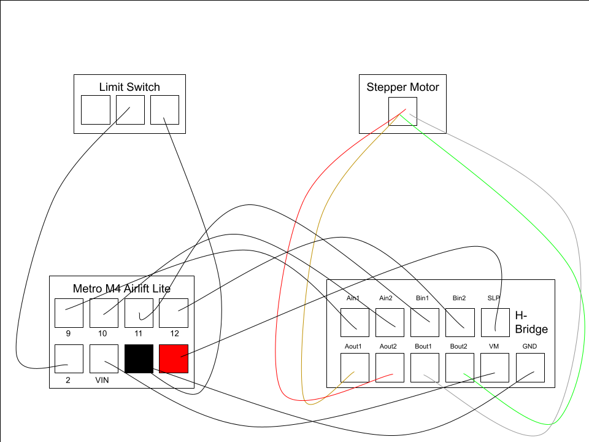

### Reflection

I was extremely confused by the asyncio things, but I think I sorta kinda understand them now. The only things that still confuse me a little bit are the await and with lines, which allow the program to run asycrinously, I just don't know how. In the end though, this assignment helped me learn how to declare functions in circitpython and introduced me to a new, maybe better, type of motor.


## IR Sensor

### Description & Code
We were assigned to make the on-board neopixel change color based on whether an IR sensor saw anything or not

<details>
<summary>Code</summary>
<br>

```python
import neopixel
import board
import digitalio
#Imports

# Initialize the on-board neopixel and set the brightness.
led = neopixel.NeoPixel(board.NEOPIXEL, 1)
led.brightness = 0.3

# Set up the IR Sensor using digital pin 2.
ir_sensor = digitalio.DigitalInOut(board.D2)

# Set the photointerrupter as an input.
ir_sensor.direction = digitalio.Direction.INPUT 
            
# Use the internal pull-up resistor.
ir_sensor.pull = digitalio.Pull.UP


# While loop runs the code inside continuously.
while True:
    # If an object is near the IR sensor (sensor is LOW):
    if(ir_sensor.value is False):
        #Set the neopixel's color to RED
        led[0] = (255, 0 , 0)
    # If nothing is near the IR sensor (sensor is HIGH)
    else:
        #Set the neopixel's color to GREEN
        led[0] = (0, 255, 0)

```
</details


### Evidence


### Wiring

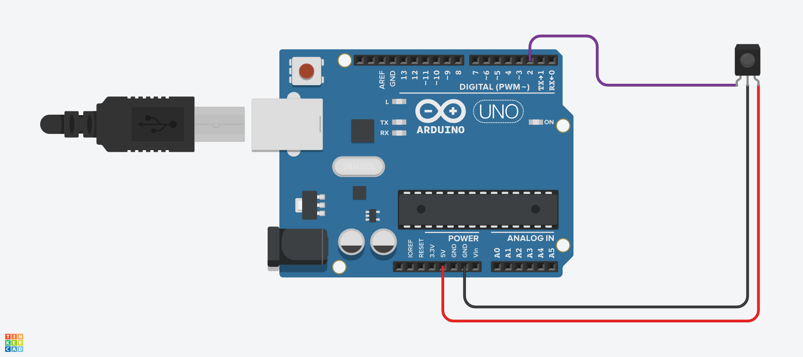

### Reflection

This assignment was extremely easy and quick (it took me less than half of a block period), but, during it, I learned how to use an IR Sensor. IR Sensors seem easier to use than an Ultrasonic sensor, but, it has greatly decreased range. This assignment could be improved if all the code wasn't given to you and it didn't all come with comments. 

## Robot Gripper

### Description
We were asssigned to create our own gripper for a robot arm. The arm could only use one actuator, it must be able to fully close, and all of the parts must be able to be manufactured in the lab.

### Evidence

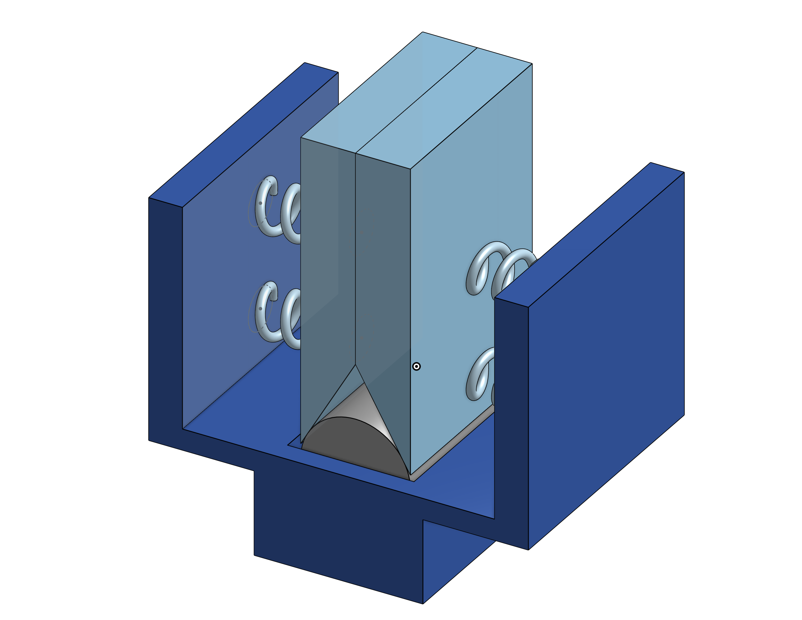

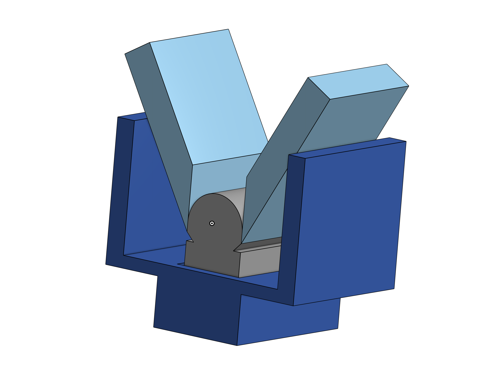

### BOM
| Part # | Quantity | Name |
| :-------------: | :-------------: | :-------------: |
| 1 | 2 | Claw |
| 2 | 1 | Pusher |
| 3 | 1 | Holder |
| 4 | 4 | Spring |

### Animation

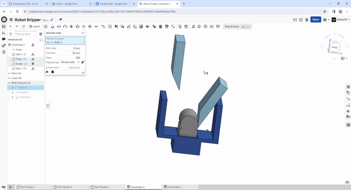

Technically meets the requirements

### Reflection

This assignment was fun in that we were turned loose to create our own designs. I had fun with my springs, but, I mainly did that to avoid having to deal with the complications of linkage. I wish I was able to see if the design actually works because I didn't get that opportunity with the limitations of CAD.

## COPY THIS

### Description & Code
Write a description of your assignment first.

<details>
<summary>How do I dropdown?</summary>
<br>

```python
Code goes here

```

</details


### Evidence
Pictures / Gifs of your work should go here.  You need to communicate what your thing does.
Remember you can insert pictures using Markdown or HTML

### Wiring

### Reflection

